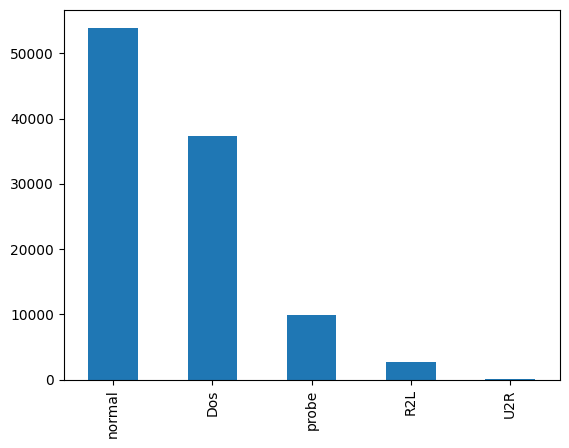
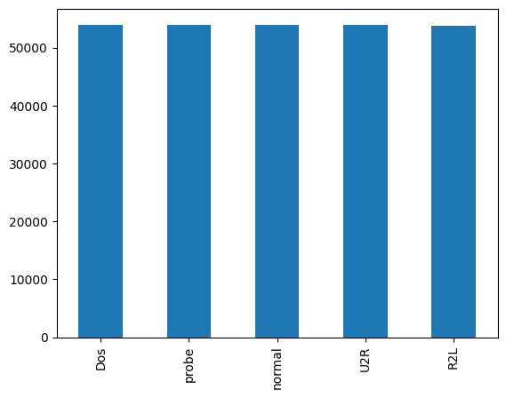

# Intrusion Detection System

## Introduction

This project focuses on developing an effective intrusion detection system (IDS) utilizing various machine learning (ML) and deep learning (DL) algorithms. The system aims to classify network traffic data into different categories, including normal and attack types, to enhance network security.

## Methodologies Used

### Data Preprocessing

- **Standardization**: Numeric features are standardized using the `StandardScaler` from `sklearn.preprocessing` to have zero mean and unit variance.
- **Label Encoding**: Categorical variables are encoded into numerical form using the `LabelEncoder` from `sklearn.preprocessing`, transforming categorical variables into numerical representations.

### Data Augmentation

To address the class imbalance in the dataset, the **ADASYN** algorithm is employed to generate synthetic instances or modify existing ones. This approach improves the model's ability to classify difficult-to-classify minority class samples by creating a more balanced representation.

### Machine Learning Algorithms

- **Gaussian Naive Bayes**: Assumes features are independent and follow a Gaussian distribution, providing computational efficiency and competitive results, especially in text classification.
- **Decision Tree**: Provides a graphical representation of possible solutions and outcomes. It handles both categorical and numerical features, capturing complex relationships but may overfit if not properly constrained.
- **Support Vector Machine (SVM)**: Finds an optimal hyperplane to separate classes and handles complex decision boundaries well, showing robustness to noise and outliers.
- **Logistic Regression**: Versatile for multi-class classification problems, with interpretable coefficients but may struggle with complex non-linear relationships and imbalanced datasets.

### Deep Learning Algorithms

- **XGBoost**: An ensemble algorithm combining weak learners, usually decision trees, to form a robust final model. It uses gradient-based optimization techniques and regularization, efficiently handling imbalanced datasets.
- **LSTM (Long Short-Term Memory)**: A recurrent neural network architecture designed to model long-term dependencies in sequential data, retaining important information over longer sequences.
- **CNN (Convolutional Neural Network)**: A deep learning architecture for image classification, using convolutional layers to capture spatial patterns. It includes pooling and fully connected layers to reduce dimensionality and interpret features.

## Tools Used

- **Python**: The primary tool for implementation, with libraries such as NumPy, Pandas, Scikit-learn, and TensorFlow facilitating data preprocessing, model building, and evaluation.
- **Jupyter Notebook**: An interactive environment for developing and documenting the project, integrating code, visualizations, and narrative text.
- **Scikit-learn**: Provides tools for data preprocessing, feature selection, and model training, enabling the integration of various ML algorithms.
- **TensorFlow**: An open-source DL framework used for building and training neural networks, including LSTM and CNN models.
- **XGBoost**: An optimized gradient boosting framework providing efficient implementations of gradient boosting algorithms.
- **Matplotlib and Seaborn**: Used for data visualization and result analysis, creating plots and charts to visualize performance metrics and dataset characteristics.
- **Anaconda**: A platform for managing project environments, simplifying the installation and setup of required libraries and dependencies.

## Results and Outputs

### Parameters Used

| **Model** | **LSTM**                           | **CNN**                         |
|-----------|------------------------------------|---------------------------------|
| **Input** | (122, 1)                           | (122, 1)                         |
| **Layer-1**| LSTM-64                            | Conv1D-32                        |
| **Dropout**| 0.2                                | Maxpool-2                        |
| **Layer-2**| LSTM-64                            | Conv1D-64                        |
| **Dropout**| 0.2                                | Maxpool-2                        |
| **Layer-3**| LSTM-64                            | Dense-128                        |
| **Dense** | 50                                 | Dropout-0.2                      |
| **Activation** | Softmax                        | Softmax                          |
| **Loss**  | Categorical Crossentropy           | Categorical Crossentropy         |
| **Optimizer** | Adam                            | Adam                             |

### Experimental Outcomes

#### Augmentation

The ADASYN algorithm effectively addressed class imbalance, increasing the training set from 103,961 samples to 269,813 samples. The balanced class distribution is as follows:

| **Type** | **Training Set** | **Resampled Training Set** |
|----------|------------------|----------------------------|
| **Normal** | 53,952           | 53,952                     |
| **DOS**    | 37,306           | 54,038                     |
| **Probe**  | 9,933            | 54,037                     |
| **R2L**    | 2,683            | 53,837                     |
| **U2R**    | 87               | 53,959                     |

**Figures:**

- **Fig 4.1**: Classes Distribution

- **Fig 4.2**: Augmented Class Distribution

#### Performance Score

**Comparison of Models Trained on Original Training Data**

| **Model**            | **Accuracy** | **Precision** | **Recall** |
|----------------------|--------------|---------------|------------|
| **Decision Tree**    | 88.26%       | 88.92%        | 88.27%     |
| **SVM**              | 86.34%       | 83.26%        | 85.16%     |
| **Logistic Regression** | 89.71%   | 84.35%        | 89.70%     |
| **XGBoost**          | 91.51%       | 92.41%        | 91.33%     |
| **LSTM**             | 93.97%       | 94.13%        | 93.97%     |
| **CNN**              | 95.62%       | 98.25%        | 98.26%     |

**Discussion:**
- **Gaussian Naive Bayes** achieved an accuracy of 76.18%, effective in handling class imbalance.
- **Decision Tree** exhibited high accuracy (88.26%) with balanced precision and recall.
- **SVM** and **Logistic Regression** showed strong performance with accuracy scores of 86.34% and 89.71%.
- **XGBoost** outperformed with an accuracy of 91.51%.
- **LSTM** and **CNN** achieved higher accuracies of 93.97% and 95.62%, capturing intricate patterns and dependencies.

**Comparison of Models Trained on Augmented Data**

| **Model**            | **Accuracy** | **Precision** | **Recall** |
|----------------------|--------------|---------------|------------|
| **Decision Tree**    | 70.12%       | 86.20%        | 70.12%     |
| **SVM**              | 94.09%       | 96.67%        | 94.09%     |
| **Logistic Regression** | 89.70%   | 94.38%        | 89.70%     |
| **XGBoost**          | 93.96%       | 94.12%        | 93.96%     |
| **LSTM**             | 95.48%       | 96.91%        | 95.48%     |
| **CNN**              | 96.40%       | 98.56%        | 98.56%     |

**Discussion:**
- Augmentation led to significant improvements in model performance, particularly in accuracy, precision, and recall.
- The ADASYN method effectively addressed class imbalance, enhancing detection capabilities.

## Conclusion

The project successfully developed an intrusion detection system using various ML and DL models. The results demonstrate the effectiveness of different algorithms and the importance of data augmentation in handling class imbalance. The deep learning models, particularly CNN, achieved the highest performance, indicating their capability to capture complex patterns in network traffic data.

## Future Work

Future work could explore the following:
- **Further Optimization**: Fine-tuning hyperparameters and experimenting with additional algorithms.
- **Real-Time Implementation**: Deploying the IDS in real-time systems for practical applications.
- **Additional Data Sources**: Incorporating more diverse datasets to improve model generalization.

## References

- [XGBoost Documentation](https://xgboost.readthedocs.io/)
- [TensorFlow Documentation](https://www.tensorflow.org/)

---

This README provides a detailed overview of the project's methodologies, tools, results, and future directions. It offers a comprehensive understanding of the intrusion detection system and its performance.
